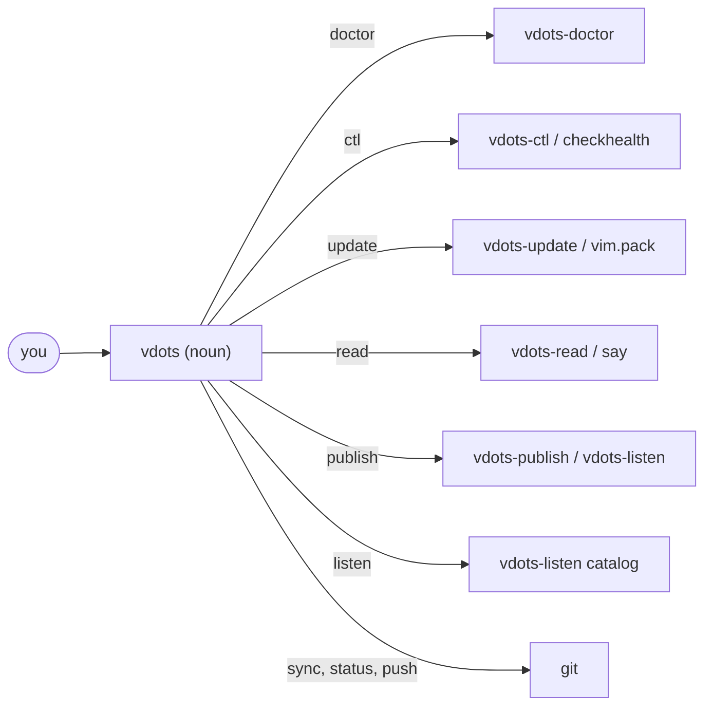
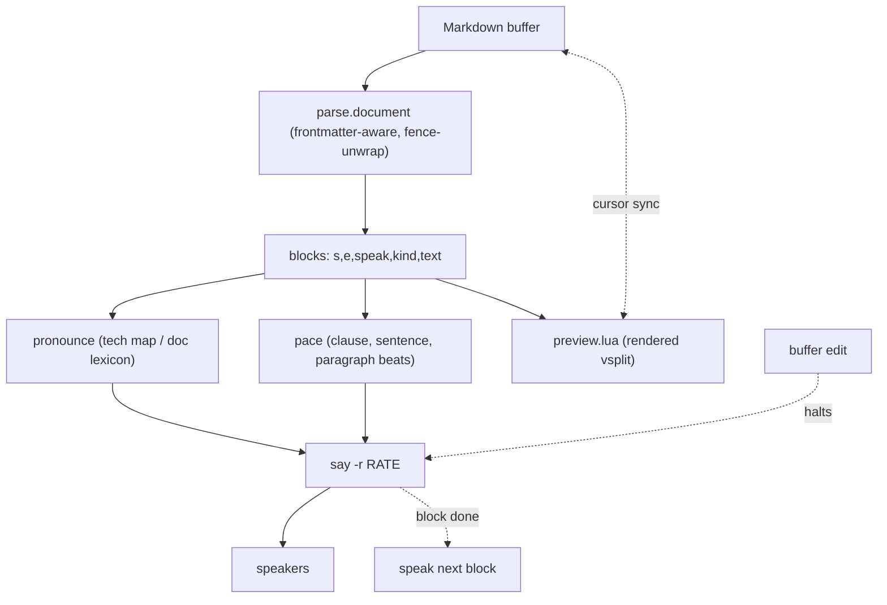
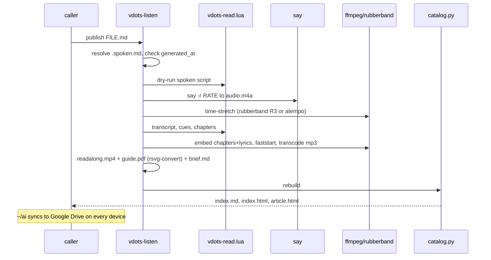

# Vdots

A native-first Neovim configuration: Lua, `vim.pack` for plugins, built-in LSP,
and a `;`-leader keymap surfaced through which-key. Ships its own doctor, update,
and test tooling. Part of a four-repo personal platform (see
[zdots](https://github.com/just3ws/zdots)); works standalone.

## Installation

```shell
git clone https://github.com/just3ws/vdots.git ~/.config/nvim
nvim   # plugins install on first launch
```

## `vdots` — control plane

`bin/vdots` is a thin dispatcher (same shape as `zdots <noun>` / `phx {…}` on the
rest of the platform). Put `~/.config/nvim/bin` on `PATH` and:

| Command | Does |
|---|---|
| `vdots doctor [--json] [--fix]` | static health check ("brew doctor" for vdots) |
| `vdots ctl check [--json]` | deep runtime probe of the live config (`:checkhealth`) |
| `vdots update [--commit]` | update plugins (`vim.pack`), prune, test |
| `vdots read [opts] FILE.md` | read a Markdown file aloud (macOS `say`) |
| `vdots publish [opts] FILE.md` | full listen-along session → the listen library |
| `vdots listen {open,rebuild,ls,path,info}` | browse the listen library |
| `vdots sync` \| `status` \| `push` | git fast-forward pull / short status / push |

Every noun also works as a standalone script (`./bin/vdots-doctor`, …), so the
repo is usable without the shim. Man pages ship in `man/` (`man vdots`,
`man vdots-publish`, …) and a zsh completion in `completions/_vdots`; the zdots
shell wires both — see [wiki: LSP & Tooling](docs/wiki/LSP-and-Tooling.md).



## Development

```shell
# Run smoke + unit tests
./test/run.sh

# Update plugins, prune unmanaged packages, test, and show diff
./bin/vdots-update

# Update plugins and auto-commit lockfile changes
./bin/vdots-update --commit

# Check health & diagnostics
./bin/vdots-doctor

# Lint/format checks
luacheck . --config .luacheckrc
stylua --check .

# Apply formatting
stylua .
```

## Keymaps

Leader key is `;`. In normal mode `;` enters command mode (`:`), so
leader sequences should be typed promptly (or within `timeoutlen`).

**which-key** is active: pause after `;` for ~300 ms and a popup appears showing
all available bindings. Multi-key prefixes are labelled by group:

| Prefix | Group |
| --- | --- |
| `;ai` | AI (CodeCompanion & Local LLM) |
| `;b` | buffer |
| `;c` | code |
| `;d` | debug (DAP) |
| `;e` | explorer (nvim-tree) |
| `;f` | find / format |
| `;g` | git (Diffview, Gitsigns, Claude diff) |
| `;h` | git hunks |
| `;n` | notifications (Snacks) |
| `;P` | plugins (vim.pack) |
| `;s` | search (Telescope, Todo) |
| `;t` | test (Neotest) |
| `;u` | ui / toggle |
| `;w` | window |
| `;x` | diagnostics (Trouble) |

### General

| Key | Action |
| --- | --- |
| `;` | Enter command mode (`:`) |
| `<CR>` | Clear search highlight |
| `n` / `N` | Next / prev match (centered + opens folds) |
| `<C-d>` / `<C-u>` | Half-page down / up (centered) |
| `j` / `k` | Move by visual line (`gj` / `gk`) |
| `J` | Join lines (preserves cursor position) |
| `<A-j>` / `<A-k>` | Move line down / up (with auto-reindent) |
| `;;` | Select current line (`V`) |
| `Q` | Disabled (prevent accidental Ex mode) |

### Splits & Tabs

| Key | Action |
| --- | --- |
| `<C-h/j/k/l>` | Move between splits |
| `<S-h>` | Previous tab (`gT`) |
| `<S-l>` | Next tab (`gt`) |

### Visual Mode & Clipboard

| Key | Action |
| --- | --- |
| `<` | Indent left, keep selection |
| `>` | Indent right, keep selection |
| `p` *(visual)* | Paste without clobbering register |
| `;p` / `;P` | Paste from system clipboard (after / before) |
| `;D` | Delete into black-hole register |
| `<A-j>` / `<A-k>` | Move visual selection down / up |

### Command-line

| Key | Action |
| --- | --- |
| `<C-p>` | Previous command history entry |
| `<C-n>` | Next command history entry |

### Explorer (nvim-tree with NERDTree compatibility)

| Key | Action |
| --- | --- |
| `;e` | Toggle nvim-tree sidebar |
| `;ef` | Reveal and focus current file in tree (`:NERDTreeFind`) |
| `;er` | Collapse tree and re-reveal current file |
| `-` | Open parent directory in buffer with Oil.nvim |

*Inside the nvim-tree buffer, full NERDTree muscle-memory keys work (`t` new tab, `T` background tab, `i` split, `go`/`gi`/`gs` stay in tree, `X` collapse children, `A` zoom, `r` refresh, `<F2>` rename).*

### Search & Pickers

| Key | Action |
| --- | --- |
| `<C-p>` / `;<space>` | Telescope: find files |
| `;,` / `;fb` | Telescope: switch open buffers |
| `;/` / `;fg` | Telescope: live grep |
| `;ff` | Grep prompt → quickfix (`:Ack`, `:Ag`, `:Rg`) |
| `;fr` | Telescope: recent files |
| `;fc` | Telescope: find config file |
| `;:` | Telescope: command history |
| `;gB` | Snacks: open file/line in GitHub/GitLab browser |
| `;n` | Snacks: notification history |
| `;un` | Snacks: dismiss all notifications |
| `;bd` | Snacks: delete buffer (preserves window layout) |

### LSP & Diagnostics

| Key | Action |
| --- | --- |
| `gd` | Go to definition |
| `gI` | Go to implementation |
| `gy` | Go to type definition |
| `K` | Hover documentation |
| `gr` | References |
| `;rn` | Rename symbol |
| `;ca` | Code action |
| `;cd` | Show line diagnostic float |
| `]d` / `[d` | Next / previous diagnostic |
| `;ih` | Toggle LSP inlay hints (RubyLSP) |
| `;xx` | Toggle project diagnostics in Trouble |
| `;xX` | Toggle buffer diagnostics in Trouble |

### Completion (blink.cmp)

| Key | Action |
| --- | --- |
| `<Tab>` | Accept completion item / expand snippet |
| `<C-n>` / `<C-p>` | Navigate completion list |
| `<C-Space>` | Trigger completion menu |
| `<C-e>` | Abort completion |

### AI & Code Intelligence

| Key | Action |
| --- | --- |
| `;aia` | CodeCompanion: actions menu |
| `;aic` | CodeCompanion: chat window |
| `;aiq` | Local LLM: prompt with buffer / selection (injection-safe) |
| `;aiE` | Local LLM: explain buffer / selection |
| `;air` | Local LLM: review buffer / selection for bugs & smells |
| `:Llm {task}` | Local LLM: send buffer/range (e.g. `:'<,'>Llm refactor`) |

### Git & Diffing

| Key | Action |
| --- | --- |
| `;gd` | Diffview: open git diff |
| `;gD` | Diffview: close diff |
| `;gh` | Diffview: file history for current buffer |
| `;gC` | Diffview: open diff of file Claude Code last touched (`:ClaudeDiff`) |
| `]h` / `[h` | Jump to next / previous git hunk (Gitsigns) |
| `;hs` / `;hr` | Stage / reset git hunk |
| `;hp` | Preview git hunk in floating window |

### Testing & Debugging

| Key | Action |
| --- | --- |
| `;tr` / `;tf` | Neotest: run nearest test / run file |
| `;tl` / `;tS` | Neotest: re-run last test / stop tests |
| `;ts` / `;to` / `;tO` | Neotest: test summary / test output / output panel |
| `;db` / `;dc` | DAP: toggle breakpoint / continue debugging |
| `;di` / `;do` | DAP: step into / step over |
| `;du` / `;dr` / `;dt` | DAP: toggle UI / open REPL / terminate session |

### Plugin & Package Management (`vim.pack`)

| Key / Command | Action |
| --- | --- |
| `;L` / `;Pu` | Open interactive plugin update buffer (`:PackUpdate`) |
| `;Ps` | Sync plugins to lockfile (`:PackSync`) |
| `;Pc` | Prune unmanaged/inactive plugins from disk (`:PackClean`) |
| `;PS` | View installed plugin count & status (`:PackStatus`) |
| `./bin/vdots-update` | Terminal script: update, clean, test, and show diff |
| `./bin/vdots-update -c` | Terminal script: update, test, and auto-commit |

### Commands

| Command | Action |
| --- | --- |
| `:Ack [query]` | Ripgrep text across project into quickfix |
| `:Ag [query]` | Alias for `:Ack` / `:Rg` |
| `:Rg [query]` | Ripgrep text across project into quickfix |
| `:PackUpdate` | Interactive plugin update review buffer |
| `:PackSync` | Synchronize plugins to lockfile revisions |
| `:PackClean` | Prune unmanaged plugins from disk |
| `:PackStatus` | Display active plugin summary toast |
| `:ClaudeDiff` | Diff the file Claude Code last touched |
| `:NvimUsage` | Display usage & friction telemetry report |
| `:NvimUsageReset` | Clear the local friction telemetry log |
| `:NvimErrors` | Open recent error log with diagnostic context |
| `:Reload` | Re-source `$MYVIMRC` |
| `:Vimrc` / `:Svimrc` / `:Tvimrc` / `:Vvimrc` | Edit / split / tab / vsplit vimrc |
| `:Zshenv` / `:Szshenv` / `:Tzshenv` / `:Vzshenv` | Edit / split / tab / vsplit `.zshenv` |
| `:ZdotsIngest` | Ingest buffer into zdots platform |
| `:ZdotsStatus` | Show zdots platform status in float |
| `:VdotsRead` / `:VdotsReadFromHere` | Read Markdown aloud (top / from cursor) — opens the preview pane |
| `:VdotsReadStop` / `:VdotsReadClose` | Stop the voice / close the preview pane |
| `:VdotsReadRefresh` | Re-render the preview from the source |
| `:VdotsReadInfo` | Parse / frontmatter interpretation + frontmatter↔body drift |
| `:VdotsReadExport` | Quick throwaway .m4a of the buffer/range + open it |
| `:VdotsReadPublish` | Add the doc + read-through to the listen library (Google Drive) |
| `:VdotsRecentMarkdown` | Pick from recently opened Markdown files |

## Read Markdown aloud

A two-pane reader (`lua/vdots/readaloud/`, macOS `say`, offline). `;rr` opens a
read-only **rendered preview** vsplit; you keep editing on the left while it
reads the right pane block by block, highlighting and centering the active
block in both panes with the cursor synced. Spoken text is markup-stripped and
run through a tech-pronunciation pass (`API` → "A P I", `nginx` → "engine ex").
Editing halts playback; `:w` re-renders; `;rr` resumes from the cursor.



The player is a small state machine in `player.lua`: `speak(i)` shells one
`say` per block; `;rp` pauses, `;r]`/`;r[` jump, `;rr` resumes from the block
under the cursor. `pace.say_rate()` folds the pace preset's time-stretch into
the live `say` rate (interactive playback can't post-process).

Keymaps — buffer-local to `markdown` and the preview pane, prefix `;r`:

| Key | Action |
| --- | --- |
| `;rr` | Start / play from cursor (opens the preview) |
| `;rp` | Pause / resume |
| `;r]` / `;r[` | Next / previous block (re-reads from its start) |
| `;rs` / `;rq` | Stop / close the preview pane |
| `;rf` | Refresh the preview now |
| `;ri` | Info: parse / frontmatter interpretation + drift check |
| `;rx` | Quick export (throwaway .m4a) + open player |
| `;rP` | Publish to the listen library (`:VdotsReadPublish!` to re-record) |

Hardware media keys (F7/F8/F9, Touch Bar, AirPods) work via a Swift Now-Playing
helper — best-effort; the reliable remote is a SwiftBar menu-bar item
(`vdots doctor --fix` installs it). Full docs: `:help vdots-readaloud`.
`:checkhealth vdots.readaloud`.

Config (all optional). `voice = nil` auto-picks by `tone` (**`warm`** default /
`clarity`); `pace` (**`follow`** = most space — the finished audio is
time-stretched (`rubberband`, or `ffmpeg atempo`) for an unhurried feel, plus
beats at punctuation and between paragraphs / `relaxed` / `natural`) sets the
words-per-minute, stretch, and pause lengths. The Premium/Enhanced
neural voices are what make it sound human — download **`Zoe (Premium)`** from
System Settings ▸ Accessibility ▸ Spoken Content ▸ Manage Voices and it's
auto-picked. Audition: `vdots-read --sample --voice "Zoe (Premium)"`.

```lua
vim.g.vdots_readaloud = {
  voice = nil, tone = "warm", pace = "follow", rate = nil,
  skip_code = true, skip_tables = false,
  preview = true, sync_cursor = true, stop_on_edit = true, media_keys = true,
  pronounce = { kubectl = "koob cuttle", myjargon = "my jargon" },
  player = nil, -- external player for :VdotsReadExport; nil = vim.ui.open
}
```

Headless: `vdots read [--export|--dry-run] [--voice V] [--rate N] FILE.md`.

### Listen library



`;rP` / `:VdotsReadPublish` — or `vdots publish FILE.md` from the shell — files
the document into `~/ai/outbox/listen/<date-slug>/` as role-named files:

- **`audio.mp3`** — the read-through (Drive's Android app plays it inline;
  transcript embedded as an id3 lyrics track). `audio.m4a` = same audio,
  chapters + faststart, for Apple Music / VLC.
- **`readalong.mp4`** — the transcript scrolling with the narration, burned
  into the frames. Plays in Google Drive's *video* player (web, iOS, Android)
  — synced read-along that works where `article.html` can't. Carries MP4
  metadata + an embedded caption track, and a same-name `readalong.vtt`
  sidecar (Drive's player uses it for CC).
- **`guide.pdf`** — `document.md` rendered as a paginated, OCR-friendly
  text-image PDF (one text column per page, large type). One attachment to drop
  into an AI chat instead of juggling loose files — packaging convenience, not
  a token saving. Built by `vdots-guide-image` when `rsvg-convert` is present.
- **`brief.md`** — a self-contained analysis brief (what this is, the chapters,
  what to help with, then the full transcript inline). Open it in Gemini
  straight from Drive.
- **`manifest.md`** *(interview-prep packs)* — a research kit for any AI chat:
  a map of every relevant file (this package + the wwworkremote source pack +
  your public résumé/portfolio) with web links, so ChatGPT / Gemini / Claude
  can do independent research on the role. `$VDOTS_RESUME_URL` /
  `$VDOTS_PORTFOLIO_URL` override the candidate links.
- `document.md`, `report.md` (readability + chapters + transcript,
  Drive-previewable), `transcript.txt`, `captions.vtt`.
- `article.html` — a browser page that plays the audio while the transcript
  highlights and auto-scrolls (click a paragraph to seek). Browser-only:
  Drive's HTML preview runs no JS.
- `assets/` — machine files (cues, readability, chapters, spoken script).

`~/ai` is synced by Google Drive desktop; on a phone open the `index.md`
catalog — Drive renders it and the links play the video / mp3 / open the
brief. `vdots publish --info FILE.md` is a pre-flight report; `-v` narrates
every step; `:VdotsReadPublish!` re-records after edits.

**Tips:** `;r[` re-hears a missed paragraph · pause → edit → `:w` → `;rr` resumes
from that block · slow `rate` for dense docs · teach it project jargon once in
`pronounce` · `;rP` a long doc and listen on a walk.

## The homepage (dashboard)

The Snacks dashboard shows an inline **Recent Files** list and a longer
**Recent Markdown** list (`;m` / `:VdotsRecentMarkdown` opens the picker for the
latter). Depth comes from `shada` keeping 1000 `oldfiles` (see
`lua/editor/options.lua`); "what counts as Markdown" is
`lua/editor/mdfiles.lua`.

## Abbreviations

Typo corrections are global (safe in prose). Programming shortcuts are
buffer-local — they only expand in the listed filetypes.

### Typo corrections (all filetypes)

Common misspellings auto-corrected in insert mode: `cant`, `dont`, `wont`,
`teh`, `alos`, `aslo`, `becuase`, `bianry`, `charcter`, `exmaple`, `shoudl`,
`seperate`, `tpyo`, `optino`, `udpate`, `typdef`, `flase`, `taht`, `resposne`, `fro`.

### Programming shortcuts (filetype-scoped)

| Shortcut | Expands to | Filetypes |
| --- | --- | --- |
| `re` | `return` | Go, Ruby, JavaScript, TypeScript, Lua |
| `fu` | `func` | Go |
| `fun` | `func` | Go |
| `im` | `import` | Go, JavaScript, TypeScript |
| `pa` | `package` | Go |
| `ma` | `main` | Go |
| `pu` | `public` | Ruby, JavaScript, TypeScript |
| `pr` | `private` | Ruby, JavaScript, TypeScript |
| `it` | `it {  }` | Ruby (RSpec) |
| `desc` | `describe "" do end` | Ruby (RSpec) |
| `cont` | `context "" do end` | Ruby (RSpec) |

