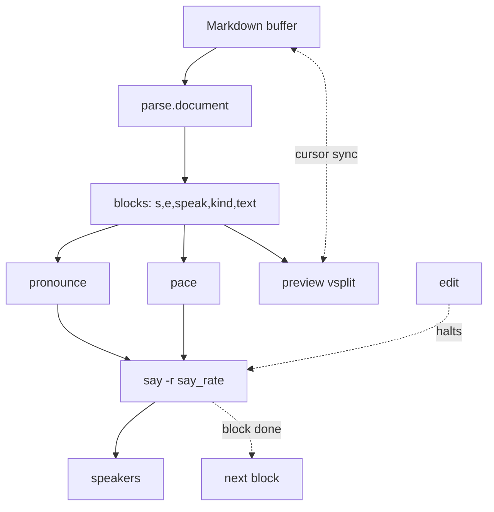
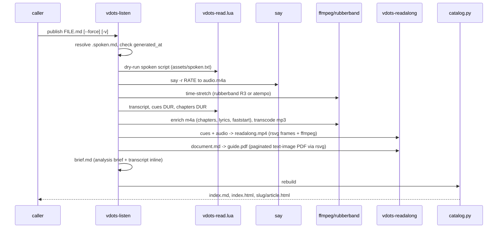

# Read-Aloud

An offline Markdown reader for Neovim (macOS `say`), plus a publish pipeline
that turns a document into a synced listen-along session on Google Drive.

- Plugin: `lua/vdots/readaloud/`
- CLI: `bin/vdots-read`, `bin/vdots-publish`, `bin/vdots-listen`, `bin/vdots-readalong`, `bin/vdots-guide-image`
- Vim help: `:help vdots-readaloud` (`doc/vdots-readaloud.txt`)
- Health: `:checkhealth vdots.readaloud` · `vdots doctor`

## In the editor

`;rr` on a Markdown buffer opens a read-only **rendered preview** vsplit and
starts reading, block by block, highlighting and centering the active block in
both panes with the cursor synced. Editing halts playback; `:w` re-renders;
`;rr` resumes from the block under the cursor.

| Key | Action | Command |
|---|---|---|
| `;rr` | play from cursor (opens preview) | `:VdotsRead` |
| `;rp` | pause / resume | |
| `;r]` / `;r[` | next / previous block | `:VdotsReadFromHere` |
| `;rs` / `;rq` | stop / close preview | `:VdotsReadStop` / `:VdotsReadClose` |
| `;rf` | refresh preview now | `:VdotsReadRefresh` |
| `;ri` | parse / frontmatter / drift report (float) | `:VdotsReadInfo` |
| `;rx` | quick export (throwaway `.m4a`) | `:VdotsReadExport` |
| `;rP` | publish to the listen library | `:VdotsReadPublish[!]` |

### Module map

```
lua/vdots/readaloud/
  init.lua        keymaps + attach()
  config.lua      vim.g.vdots_readaloud resolution + voice picking
  parse.lua       Markdown → speech blocks; parse.document() = frontmatter +
                  fence-unwrap entry point, keeps source line ranges (s,e)
  frontmatter.lua enhanced-doc YAML contract (format / pronunciation+sections+
                  spoken_minutes triple)
  pronounce.lua   tech map (API → "A P I") + per-doc lexicon
  pace.lua        rate + clause/sentence/paragraph beats + whole-file stretch;
                  cues / chapters / VTT timing; M.presets is the tuning surface
  preview.lua     rendered vsplit + cursor sync (frontmatter hidden 1:1)
  player.lua      say state machine: speak(i) / pause / jump / resume; publish
  mediakeys.lua   Swift Now-Playing helper (best-effort)
  health.lua      :checkhealth vdots.readaloud
```

### Data flow



## Pacing

Two levers, kept apart (`pace.lua`):

1. **Boundary silence** — a beat at clause marks (`, ; :`), a longer rest at
   sentence ends (`. ! ?`), larger gaps between paragraphs and before headings.
   These land where a speaker actually pauses, so `say` keeps its phrase melody.
2. **`stretch`** — the finished audio is time-stretched, pitch preserved, so the
   gaps `say` already leaves between words get longer. `rubberband` (R3 engine)
   if installed, else `ffmpeg atempo`. Live playback / quick export can't
   post-process, so there `M.say_rate()` folds the stretch into the `say` rate.

Inserting `[[slnc]]` between every word was tried and removed — it made each
word its own utterance and killed the flow.

| preset | rate | stretch | clause | sentence | paragraph | heading |
|---|---|---|---|---|---|---|
| `follow` (default) | 168 | 0.90 | 75 ms | 300 ms | 360 ms | 680 ms |
| `relaxed` | 182 | 0.95 | 60 | 240 | 300 | 540 |
| `natural` | 200 | 1.0 | 45 | 180 | 190 | 360 |

`rate` (config or `--rate`) overrides only the words-per-minute.

## Voices

`voice = nil` auto-picks the best installed voice for `tone` (`warm` default /
`clarity`). The Premium/Enhanced neural voices sound human — install
**`Zoe (Premium)`** from *System Settings ▸ Accessibility ▸ Spoken Content ▸
Manage Voices*. Siri voices (`Siri Voice 4`) work but aren't listed by
`say -v ?`, so pass them explicitly. Audition:
`vdots-read --sample --voice "Zoe (Premium)"`.

## Enhanced read-aloud documents

A document is *enhanced* if its YAML frontmatter has `format: …read-aloud`, or
the `pronunciation:` + `sections:` + `spoken_minutes:` triple. Then:

- the body is treated as **speech-ready** — never re-expanded, rewritten,
  summarised, reordered, or dropped
- `pronunciation:` is a per-document lexicon applied to **audio only**; the
  transcript and captions keep the written spelling
- `sections:` become chapters in the audio, captions, and transcript
- headings are spoken plainly (no "Heading level 2")
- `spoken_minutes:` is a sanity check (warn at >40% off); `generated_at:` gates
  a re-publish (skip if not newer)

## The publish pipeline

`;rP` / `vdots publish FILE.md` → a dated session directory synced by Google
Drive desktop.



### Session layout

```
~/ai/outbox/listen/
  index.md          catalog for phones — Drive renders it, links play the media
  index.html        catalog for a browser (player + links per article)
  2026-09-02-…-slug/
    audio.mp3        read-through; transcript embedded as an id3 lyrics frame
    audio.m4a        same audio, +faststart +chapters (Apple Music / VLC)
    readalong.mp4    transcript scrolling with the narration, burned in — plays
                     in Google Drive's video player (web / iOS / Android).
                     MP4 metadata + embedded mov_text captions.
    readalong.vtt    same-basename caption sidecar (Drive's player reads it)
    guide.pdf        document.md as a paginated, OCR-friendly text-image PDF —
                     one attachment to drop into an AI chat (Gemini/ChatGPT/Claude)
    brief.md         self-contained analysis brief — open in Gemini from Drive
    manifest.md      interview-prep packs: a research kit (file map + web links)
                     for any AI chat to research the job independently
    document.md      clean readable copy of the source
    report.md        readability + chapters + full transcript (Drive-previewable)
    transcript.txt   verbatim prose
    captions.vtt     WebVTT captions
    article.html     browser page: player + synced, auto-scrolling transcript
    meta.json        title, date, duration, voice, pace, chapters, metrics
    assets/          cues.json · readability.json · chapters.{vtt,json} · spoken.txt
```

`brief.md` adapts to the doc's `kind`/`format` — an interview-prep pack gets
"draft STAR answers, pressure-test the gaps, research the company"; anything
else gets "summarise per section, flag what to verify, research the source".

`manifest.md` is emitted only for `kind: interview-prep`. It is a *map*, not a
copy: the job posting URL, the résumé JSON URL (`$VDOTS_RESUME_URL`, default
`just3ws.github.io/resume.json`), the portfolio URL, the wwworkremote source
pack path, the candidate-exports path, and a research brief. Paste it into any
AI chat with web access; it fetches the URLs and asks you to attach the local
files. This keeps job research separate from — and cross-checkable against —
the prep pack itself.

`guide.pdf` is `document.md` rendered by `vdots-guide-image` as a paginated
PDF — one text column per page, large type, wide margins. It exists for AI
chats that only take uploads or where attaching a dozen loose files is
awkward: drop the one PDF and the model reads the pages. It is not a
token-efficiency trick (an image of text costs at least as many tokens as the
text) — it is a packaging convenience. Built whenever `rsvg-convert` is
present; skipped gracefully otherwise.

### What plays where

| Surface | Plays | Synced transcript |
|---|---|---|
| **`readalong.mp4` in Google Drive** (phone or web) | ✅ video | ✅ burned in — scrolls with the narration |
| `audio.mp3` opened in Google Drive | ✅ audio | id3 lyrics (some players) |
| `index.md` in Drive | via links | via the video link |
| `report.md` / `transcript.txt` in Drive | ❌ | read it yourself |
| `brief.md` in Gemini (from Drive) | ❌ | full transcript + analysis prompt inline |
| `article.html` from a **real web server / local browser** | ✅ | ✅ highlight + auto-scroll + click-to-seek |
| `article.html` in **Drive's preview** | ❌ | ❌ — Drive sandboxes JS + media |

Drive's HTML preview runs no JavaScript, so `article.html`'s synced player
cannot work there. **`readalong.mp4` is the Drive read-along** — the transcript
is part of the video frames, so it needs nothing but a video player. Built by
`vdots-readalong` (rsvg-convert frames + ffmpeg); skipped gracefully if
`rsvg-convert` is absent.

## CLI reference

`man vdots`, `man vdots-read`, `man vdots-publish`, `man vdots-listen`,
`man vdots-readalong`, `man vdots-guide-image` (shipped in `man/`, wired by the
zdots shell).
`vdots-read --help` etc.

## Dependencies

| Tool | For | Fallback |
|---|---|---|
| `say` | speech (macOS only) | — (required) |
| `ffmpeg` | chapters, faststart, mp3, atempo stretch, video encode | no chapters, no stretch, no video |
| `rubberband` | high-quality (R3) time-stretch | `ffmpeg atempo` |
| `rsvg-convert` | renders the `readalong.mp4` frames and `guide.pdf` pages | no video / no guide PDF (`brew install librsvg`) |
| `jq` | frontmatter read in `vdots-listen` | plain-doc fallback |
| `python3` | readability + catalog generator | no report / catalog |

`brew` installs `ffmpeg` + `rubberband` (zdots `Brewfile.common`).
`:checkhealth vdots.readaloud` and `vdots doctor` report what's present.
